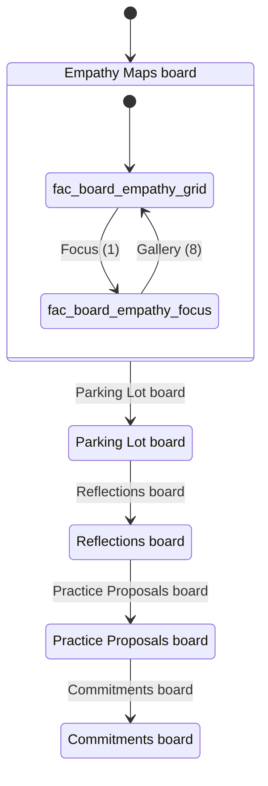
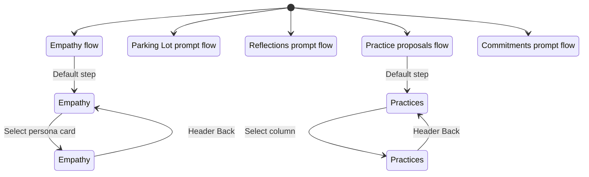

# ACC Empathy Workshop — UI flow diagrams

Visual maps of how facilitators and participants move through the workshop app. Each diagram below focuses on one slice of the experience — from opening a link on your phone to syncing stickies on the projector.

Generated from `docs/ui-flow.seed.json` by `scripts/ui-flow-to-mermaid.js`. Re-generate after seed changes: `npm run diagrams`

## Reading the diagrams


| Arrow style     | Meaning                                                  |
| --------------- | -------------------------------------------------------- |
| Solid (`-->`)   | Someone tapped a button or followed a link               |
| Dotted (`-.->`) | Automatic step (loading, lock check, preview auto-enter) |
| Thick (`==>`)   | Storage sync — facilitator change propagates to phones   |


## Diagram guide


| Diagram                                                                            | Who it's for                    | What it answers                                                                                                                                                                                                                                                           |
| ---------------------------------------------------------------------------------- | ------------------------------- | ------------------------------------------------------------------------------------------------------------------------------------------------------------------------------------------------------------------------------------------------------------------------- |
| [Overview — full workshop navigation](#overview)                                   | Everyone                        | The single map of how the workshop app fits together: how people enter as facilitator or participant, what each role sees, and how the projector and phones connect.                                                                                                      |
| [URL & bootstrap — how to open the app](#layer-url)                                | Facilitators, tech setup        | Shows the only two browser addresses the app uses (`/` for the live workshop, `/preview` for the design demo) and how query parameters skip the landing screen.                                                                                                           |
| [Role shells — facilitator vs participant](#layer-top-level)                       | Facilitators, product reviewers | What happens immediately after someone chooses a role.                                                                                                                                                                                                                    |
| [Facilitator boards — workshop agenda on the projector](#layer-facilitator-boards) | Facilitators                    | The five phases you move the room through by clicking tabs: Empathy Maps, Parking Lot, Reflections, Practice Proposals, and Commitments.                                                                                                                                  |
| [Facilitator tools — room controls beyond boards](#layer-facilitator-tools)        | Facilitators                    | Utilities in the header bar for running the session: show a QR code so phones can join, display the current prompt full-screen on the projector, pace the agenda with the timer, and open settings to edit personas, reclassify stickies, print a PDF, or wipe test data. |
| [Participant board flows — what phones show per phase](#layer-participant-boards)  | Facilitators, participants      | The submission experience on a phone for each workshop phase.                                                                                                                                                                                                             |
| [Participant overlays — modals and parking shortcut](#layer-participant-overlays)  | Participants, facilitators      | Pop-ups and shortcuts on the phone that sit above the active board.                                                                                                                                                                                                       |
| [Cross-role sync — how projector and phones stay aligned](#layer-cross-role)       | Facilitators, tech setup        | The behind-the-scenes contract between devices.                                                                                                                                                                                                                           |


## overview

**Overview — full workshop navigation**

*For:* Everyone

The single map of how the workshop app fits together: how people enter as facilitator or participant, what each role sees, and how the projector and phones connect. Start here if you are onboarding facilitators or explaining the tool to stakeholders.

**What to look for:** URL entry points at the top, the landing role chooser, facilitator board tabs, participant flows driven by storage sync (thick arrows), and the parking-lot shortcut available on every board.


## layer-url

**URL & bootstrap — how to open the app**

*For:* Facilitators, tech setup

Shows the only two browser addresses the app uses (`/` for the live workshop, `/preview` for the design demo) and how query parameters skip the landing screen. Use this when building join links, testing QR codes, or sharing the preview canvas.

**What to look for:** Deep links like `/?role=participant` (phone join) and `/?role=facilitator` (projector). Dotted arrows are automatic steps, such as the preview page clicking the role buttons for you.


## layer-top-level

**Role shells — facilitator vs participant**

*For:* Facilitators, product reviewers

What happens immediately after someone chooses a role. The facilitator may hit a lock screen if another tab is already driving the room; the participant waits briefly while connecting to shared storage. This diagram clarifies who controls the agenda and what each side can navigate.

**What to look for:** Only the facilitator can exit back to landing. Participant board content follows the facilitator's active tab (thick `==>` arrows). Facilitator tools (QR, prompt, settings) branch off the main shell.

```mermaid
flowchart TD
  %% Role shells
  landing["Landing"]
  participant_shell["Participant app shell"]
  facilitator_shell["Facilitator app shell"]
  centered_loader{{"Connecting / Loading"}}
  fac_lock_pending{{"Facilitator lock"}}
  fac_lock_displaced(["Facilitator lock"])
  bootstrap["App bootstrap"]
  preview_canvas["Preview canvas"]
  fac_board_empathy["Empathy Maps board"]
  fac_board_parking["Parking Lot board"]
  fac_board_reflections["Reflections board"]
  fac_board_practices["Practice Proposals board"]
  fac_board_commitments["Commitments board"]
  fac_qr_panel(["QR"])
  fac_big_prompt(["Big prompt (projector intro)"])
  fac_agenda_timer["Agenda timer"]
  fac_settings(["Settings"])
  part_flow_empathy["Empathy flow"]
  part_flow_simple_parking["Parking Lot prompt flow"]
  part_flow_simple_reflections["Reflections prompt flow"]
  part_flow_practices["Practice proposals flow"]
  part_flow_simple_commitments["Commitments prompt flow"]
  part_parking_overlay(["Parking lot overlay"])
  bootstrap -->|"Navigate to / with no role query"| landing
  bootstrap -->|"?role=participant"| participant_shell
  bootstrap -->|"?role=facilitator"| facilitator_shell
  bootstrap -->|"Navigate to /preview"| preview_canvas
  preview_canvas -.->|"Auto-click participant landing button"| participant_shell
  preview_canvas -.->|"Auto-click facilitator landing button"| facilitator_shell
  landing -->|"I'm a Participant"| participant_shell
  landing -->|"I'm the Facilitator"| facilitator_shell
  facilitator_shell -->|"Exit header button"| landing
  participant_shell -.->|"Initial mount while loading"| centered_loader
  centered_loader -.->|"Storage poll complete"| participant_shell
  facilitator_shell -.->|"Initial mount or lock checking"| centered_loader
  centered_loader -.->|"Another facilitator holds fresh lock"| fac_lock_pending
  centered_loader -.->|"Lock acquired or stale"| facilitator_shell
  fac_lock_pending -->|"Take over as facilitator"| facilitator_shell
  fac_lock_pending -->|"Exit"| landing
  facilitator_shell -.->|"Lock heartbeat detects another session"| fac_lock_displaced
  fac_lock_displaced -->|"Take it back"| facilitator_shell
  fac_lock_displaced -->|"Exit"| landing
  facilitator_shell -->|"Board tab · Empathy Maps"| fac_board_empathy
  facilitator_shell -->|"Board tab · Parking Lot"| fac_board_parking
  facilitator_shell -->|"Board tab · Reflections"| fac_board_reflections
  facilitator_shell -->|"Board tab · Practice Proposals"| fac_board_practices
  facilitator_shell -->|"Board tab · Commitments"| fac_board_commitments
  facilitator_shell -->|"QR header button"| fac_qr_panel
  fac_qr_panel -->|"Close or backdrop click"| facilitator_shell
  facilitator_shell -->|"Prompt header button"| fac_big_prompt
  fac_big_prompt -->|"Close or backdrop click"| facilitator_shell
  facilitator_shell -->|"Clock icon"| fac_agenda_timer
  facilitator_shell -->|"Settings gear"| fac_settings
  fac_settings -->|"Close or backdrop click"| facilitator_shell
  participant_shell ==>|"activeBoard = empathy (from storage)"| part_flow_empathy
  participant_shell ==>|"activeBoard = parking"| part_flow_simple_parking
  participant_shell ==>|"activeBoard = reflections"| part_flow_simple_reflections
  participant_shell ==>|"activeBoard = practices"| part_flow_practices
  participant_shell ==>|"activeBoard = commitments"| part_flow_simple_commitments
  participant_shell -->|"Add to Parking Lot FAB"| part_parking_overlay
  part_parking_overlay -->|"Close or Back to workshop after success"| participant_shell
  fac_qr_panel -->|"Participant scans QR (?role=participant)"| participant_shell
```




## layer-facilitator-boards

**Facilitator boards — workshop agenda on the projector**

*For:* Facilitators

The five phases you move the room through by clicking tabs: Empathy Maps, Parking Lot, Reflections, Practice Proposals, and Commitments. Switching tabs updates every participant phone within a few seconds. On Empathy Maps you can show all eight personas at once (gallery) or zoom into one (focus).

**What to look for:** Linear tab order across boards. The nested Empathy Maps state shows gallery ↔ focus toggles while staying on the same board.




## layer-facilitator-tools

**Facilitator tools — room controls beyond boards**

*For:* Facilitators

Utilities in the header bar for running the session: show a QR code so phones can join, display the current prompt full-screen on the projector, pace the agenda with the timer, and open settings to edit personas, reclassify stickies, print a PDF, or wipe test data.

**What to look for:** QR links out to the participant join URL. Settings has four tabs; persona editing and print/export are one level deeper.


## layer-participant-boards

**Participant board flows — what phones show per phase**

*For:* Facilitators, participants

The submission experience on a phone for each workshop phase. Participants never pick the board themselves — they always see whatever the facilitator has activated. Empathy and Practice Proposals use two-step flows; the other boards are a single prompt and submit.

**What to look for:** Back navigation within empathy and practices flows. Simple boards (parking, reflections, commitments) have no sub-steps in this diagram.




## layer-participant-overlays

**Participant overlays — modals and parking shortcut**

*For:* Participants, facilitators

Pop-ups and shortcuts on the phone that sit above the active board. The parking-lot button is always available at the bottom so operational concerns can be captured without leaving the current exercise. After submitting, the posted confirmation lets people add another note or switch persona.

**What to look for:** Parking overlay reachable from any board. Sample empathy map is only offered during persona selection. Posted modal paths differ for empathy vs other boards.


## layer-cross-role

**Cross-role sync — how projector and phones stay aligned**

*For:* Facilitators, tech setup

The behind-the-scenes contract between devices. No URLs change when the facilitator switches boards — shared storage carries state. Facilitator tab changes push the active board to phones; participant submissions flow back to the projector. Only one facilitator session can drive a room at a time.

**What to look for:** Four sync channels: active board, sticky submissions, persona edits, and facilitator lock heartbeat.

```mermaid
sequenceDiagram
  %% Facilitator ↔ participant sync
  %% sync-active-board: Participant main content switches between board flows; participant cannot change board
  participant Facilitator
  participant Storage
  participant Participant
  Facilitator->>Storage: set acc-active-board
  Participant->>Storage: poll
  Storage-->>Participant: Participant main content switches between board flows; participant cannot change board

  %% sync-stickies: Facilitator board views update with new stickies
  participant Participant
  participant Storage
  participant Facilitator
  Participant->>Storage: append acc-stickies-empathy, acc-stickies-parking-lot, acc-stickies-reflections, acc-stickies-practices, acc-stickies-commitments
  Facilitator->>Storage: poll
  Storage-->>Facilitator: Facilitator board views update with new stickies

  %% sync-personas: Participant persona picker reflects facilitator edits
  participant Facilitator
  participant Storage
  participant Participant
  Facilitator->>Storage: set acc-personas
  Participant->>Storage: poll
  Storage-->>Participant: Participant persona picker reflects facilitator edits

  %% sync-facilitator-lock: Only one active facilitator session per room
  participant Facilitator
  Facilitator->>Facilitator: Heartbeat every 5s; stale after 15s (acc-facilitator-lock)
```


