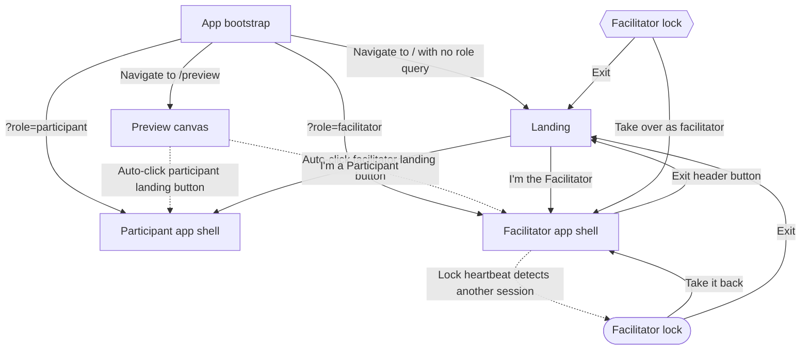
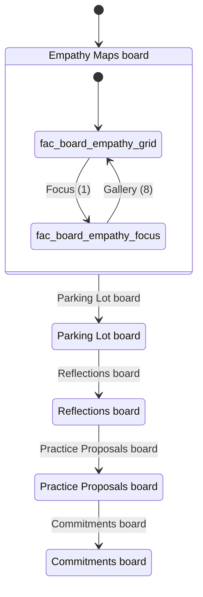
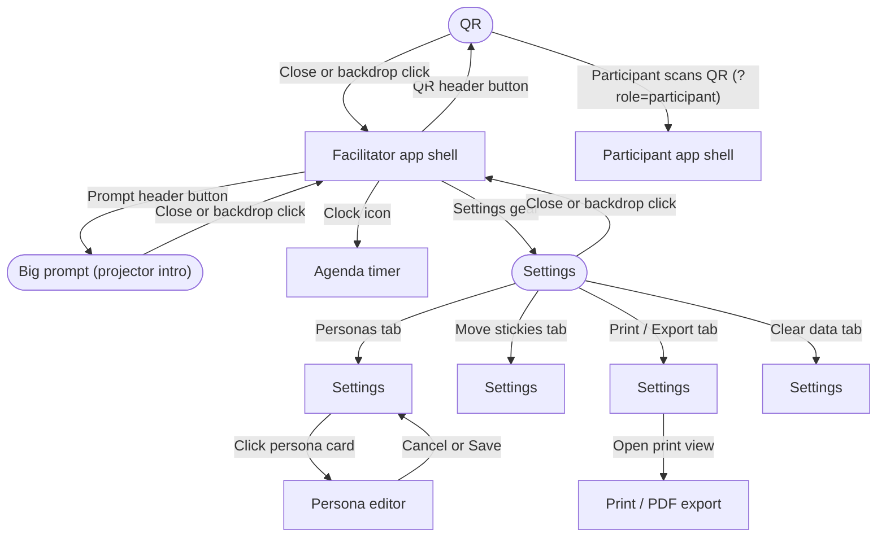
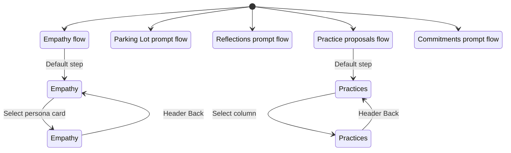
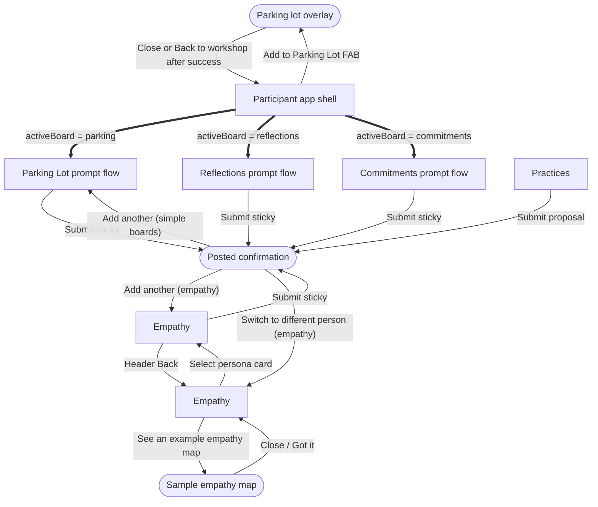

# ACC Empathy Workshop — UI flow diagrams

Generated from `docs/ui-flow.seed.json` by `scripts/ui-flow-to-mermaid.js`.

Re-generate: `npm run diagrams`

## overview

```mermaid
flowchart TD
  %% Overview: entry points and role shells
  ep_root["/"]
  ep_root --> landing
  ep_participant_deeplink["/?role=participant"]
  ep_participant_deeplink --> participant_shell
  ep_facilitator_deeplink["/?role=facilitator"]
  ep_facilitator_deeplink --> facilitator_shell
  ep_room["/"]
  ep_preview["/preview"]
  ep_preview --> preview_canvas
  bootstrap["App bootstrap"]
  landing["Landing"]
  preview_canvas["Preview canvas"]
  participant_shell["Participant app shell"]
  facilitator_shell["Facilitator app shell"]
  centered_loader{{"Connecting / Loading"}}
  fac_lock_pending{{"Facilitator lock"}}
  fac_lock_displaced(["Facilitator lock"])
  fac_board_empathy["Empathy Maps board"]
  fac_board_parking["Parking Lot board"]
  fac_board_reflections["Reflections board"]
  fac_board_practices["Practice Proposals board"]
  fac_board_commitments["Commitments board"]
  fac_qr_panel(["QR"])
  fac_big_prompt(["Big prompt (projector intro)"])
  fac_agenda_timer["Agenda timer"]
  fac_settings(["Settings"])
  part_flow_empathy["Empathy flow"]
  part_flow_simple_parking["Parking Lot prompt flow"]
  part_flow_simple_reflections["Reflections prompt flow"]
  part_flow_practices["Practice proposals flow"]
  part_flow_simple_commitments["Commitments prompt flow"]
  part_parking_overlay(["Parking lot overlay"])
  bootstrap -->|"Navigate to / with no role query"| landing
  bootstrap -->|"?role=participant"| participant_shell
  bootstrap -->|"?role=facilitator"| facilitator_shell
  bootstrap -->|"Navigate to /preview"| preview_canvas
  preview_canvas -.->|"Auto-click participant landing button"| participant_shell
  preview_canvas -.->|"Auto-click facilitator landing button"| facilitator_shell
  landing -->|"I'm a Participant"| participant_shell
  landing -->|"I'm the Facilitator"| facilitator_shell
  facilitator_shell -->|"Exit header button"| landing
  participant_shell -.->|"Initial mount while loading"| centered_loader
  centered_loader -.->|"Storage poll complete"| participant_shell
  facilitator_shell -.->|"Initial mount or lock checking"| centered_loader
  centered_loader -.->|"Another facilitator holds fresh lock"| fac_lock_pending
  centered_loader -.->|"Lock acquired or stale"| facilitator_shell
  fac_lock_pending -->|"Take over as facilitator"| facilitator_shell
  fac_lock_pending -->|"Exit"| landing
  facilitator_shell -.->|"Lock heartbeat detects another session"| fac_lock_displaced
  fac_lock_displaced -->|"Take it back"| facilitator_shell
  fac_lock_displaced -->|"Exit"| landing
  facilitator_shell -->|"Board tab · Empathy Maps"| fac_board_empathy
  facilitator_shell -->|"Board tab · Parking Lot"| fac_board_parking
  facilitator_shell -->|"Board tab · Reflections"| fac_board_reflections
  facilitator_shell -->|"Board tab · Practice Proposals"| fac_board_practices
  facilitator_shell -->|"Board tab · Commitments"| fac_board_commitments
  facilitator_shell -->|"QR header button"| fac_qr_panel
  fac_qr_panel -->|"Close or backdrop click"| facilitator_shell
  facilitator_shell -->|"Prompt header button"| fac_big_prompt
  fac_big_prompt -->|"Close or backdrop click"| facilitator_shell
  facilitator_shell -->|"Clock icon"| fac_agenda_timer
  facilitator_shell -->|"Settings gear"| fac_settings
  fac_settings -->|"Close or backdrop click"| facilitator_shell
  participant_shell ==>|"activeBoard = empathy (from storage)"| part_flow_empathy
  participant_shell ==>|"activeBoard = parking"| part_flow_simple_parking
  participant_shell ==>|"activeBoard = reflections"| part_flow_simple_reflections
  participant_shell ==>|"activeBoard = practices"| part_flow_practices
  participant_shell ==>|"activeBoard = commitments"| part_flow_simple_commitments
  participant_shell -->|"Add to Parking Lot FAB"| part_parking_overlay
  part_parking_overlay -->|"Close or Back to workshop after success"| participant_shell
```



## layer-url



## layer-top-level


## layer-facilitator-boards



## layer-facilitator-tools



## layer-participant-boards



## layer-participant-overlays



## layer-cross-role

```mermaid
sequenceDiagram
  %% Facilitator ↔ participant sync
  %% sync-active-board: Participant main content switches between board flows; participant cannot change board
  participant Facilitator
  participant Storage
  participant Participant
  Facilitator->>Storage: set acc-active-board
  Participant->>Storage: poll
  Storage-->>Participant: Participant main content switches between board flows; participant cannot change board

  %% sync-stickies: Facilitator board views update with new stickies
  participant Participant
  participant Storage
  participant Facilitator
  Participant->>Storage: append acc-stickies-empathy, acc-stickies-parking-lot, acc-stickies-reflections, acc-stickies-practices, acc-stickies-commitments
  Facilitator->>Storage: poll
  Storage-->>Facilitator: Facilitator board views update with new stickies

  %% sync-personas: Participant persona picker reflects facilitator edits
  participant Facilitator
  participant Storage
  participant Participant
  Facilitator->>Storage: set acc-personas
  Participant->>Storage: poll
  Storage-->>Participant: Participant persona picker reflects facilitator edits

  %% sync-facilitator-lock: Only one active facilitator session per room
  participant Facilitator
  Facilitator->>Facilitator: Heartbeat every 5s; stale after 15s (acc-facilitator-lock)
```
